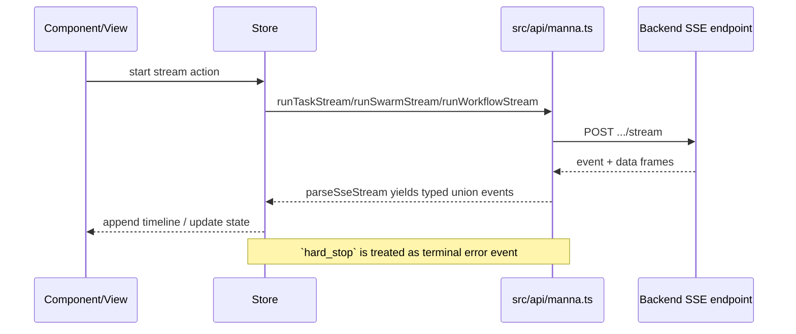

# API layer

This file defines API boundaries for HTTP, SSE, generated models, and errors.

## Official references

- OpenAPI codegen: https://github.com/ferdikoomen/openapi-typescript-codegen
- OpenAPI Zod client: https://github.com/astahmer/openapi-zod-client
- Spectral: https://meta.stoplight.io/docs/spectral
- Fetch API: https://developer.mozilla.org/en-US/docs/Web/API/Fetch_API
- Streams API: https://developer.mozilla.org/en-US/docs/Web/API/Streams_API
- Server-Sent Events (SSE): https://developer.mozilla.org/en-US/docs/Web/API/Server-sent_events

## Generated types (`api/`)

- Source: `openapi.yaml` (copied from `Guebbit/manna`) → `npm run genapi`.
- Generator: `openapi-typescript-codegen` (`npm run genapi`).
- Types have **no `I` prefix** (example: `RunRequest`, `WorkflowResponse`).
- Import via aliases: `import type { RunRequest } from '@api'` or `from '@api/api'`.
- Never edit files under `api/` manually — re-run `genapi` instead.

## Axios vs fetch (important)

- **Generated `api/` client** is configured with `--client axios` in `npm run genapi`.
- **Handwritten API module** (`src/api/manna.ts`) uses **native `fetch`** directly.
- Repo currently keeps both available; runtime flows in stores go through `src/api/manna.ts`.

## SSE event types (`src/api/sseEvents.ts`)

- Hand-written (cannot be fully generated from OpenAPI).
- Covers: `AgentStreamEvent`, `SwarmStreamEvent`, `WorkflowStreamEvent`.
- Import via: `import type { AgentStreamEvent } from '@/api/sseEvents'`.
- `hard_stop` is a terminal policy event surfaced by agent/swarm streams.

## SSE sequence

## HTTP client (`src/api/manna.ts`)

- Uses native `fetch`.
- All request/response types imported from generated `api/models/` or `sseEvents.ts`.
- Streaming endpoints are `AsyncGenerator` functions using shared `parseSseStream()`.
- Base URL always via `getMannaBaseUrl()` from `@/config`.

## Error model: `ApiError`

Defined in `src/api/manna.ts`:

- `name: 'ApiError'`
- `status: number`
- `retryAfterSeconds?: number`

Thrown by:

- `handleResponse()` for non-OK JSON responses
- `throwStreamError()` for non-OK streaming responses
- Explicit guards when expected payload data is missing

Handled by:

- Stores (e.g., `src/stores/*`) and surfaced to users via `useNotificationStore` where relevant.

## Stores → API boundary

- Stores import API functions from `@/api/manna`.
- Stores should not implement raw `fetch` calls.
- Stores may import model types for compile-time typing only.

## Deprecated / removed

- `/v1/models`, `/v1/chat/completions` — removed; do not re-add.
- `src/api/types.ts` — deleted; do not recreate.
