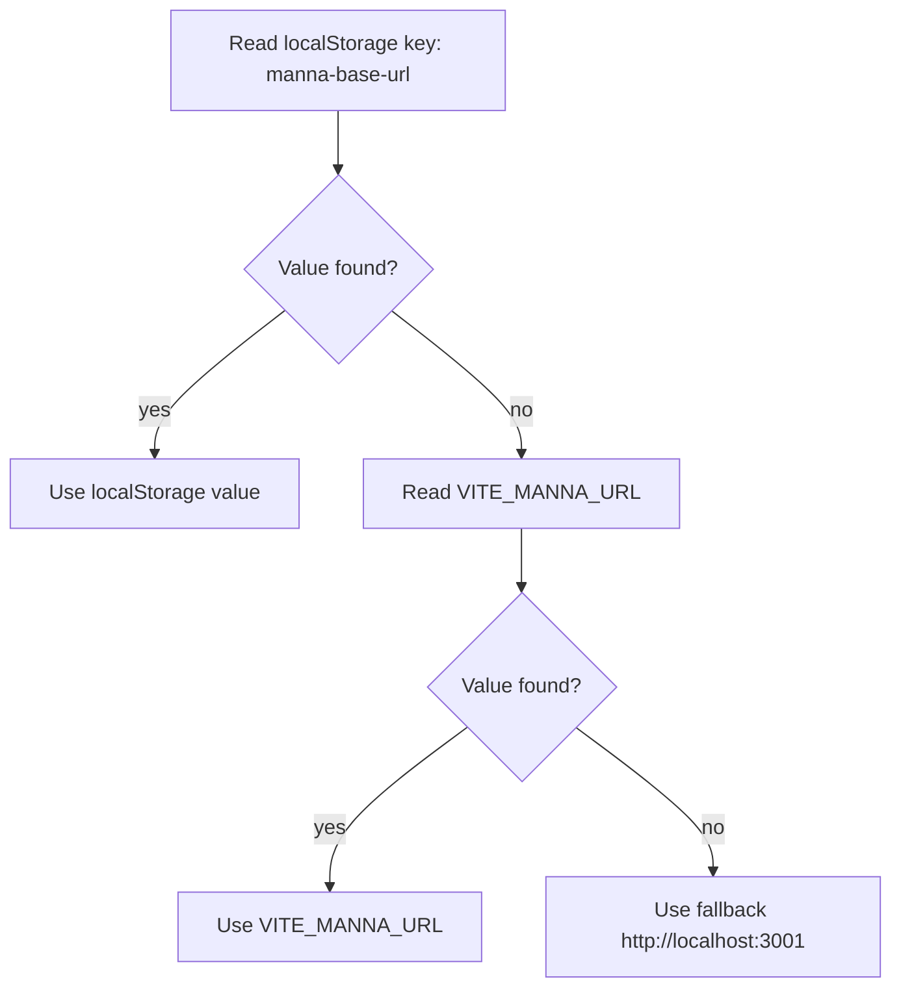

# Environment variables

Backend URL resolution is deterministic and should stay consistent across docs and code.

## Current runtime behavior

- `VITE_MANNA_URL` default example: `http://localhost:3001`
- Runtime override key: localStorage `manna-base-url`
- Source of truth implementation: `src/config.ts`

## Resolution order

## Notes

- `manna-base-url` is set by the **Settings** view at runtime.
- `VITE_MANNA_URL` is injected at build time by Vite.
- Keep docs aligned with `getMannaBaseUrl()` in `src/config.ts`.

## References

- Vite env variables: https://vite.dev/guide/env-and-mode
