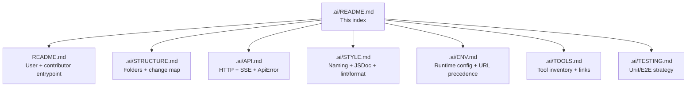

# Manna Frontend — AI index

Read this file first, then jump to the focused docs below.

## Quick identity

- **Repo:** `Guebbit/manna-frontend`
- **Stack:** Vue 3 (`<script setup lang="ts">`), TypeScript strict, Vite, Pinia, Vuetify 3, Vue Router 5
- **Backend:** `Guebbit/manna` REST API — URL from `VITE_MANNA_URL` (default `http://localhost:3001`, overridable at runtime via localStorage key `manna-base-url`)
- **User-facing entry docs:** [`../README.md`](../README.md)

## Key invariants

- API types come **only** from generated `api/models/` (no handwritten request/response shapes).
- SSE event shapes live **only** in [`../src/api/sseEvents.ts`](../src/api/sseEvents.ts).
- HTTP calls live **only** in [`../src/api/manna.ts`](../src/api/manna.ts); stores never call `fetch` directly.
- Stores handle state, API modules handle HTTP, components handle presentation.
- `npm run genapi` regenerates `api/` from `openapi.yaml`; commit the result.
- Every exported symbol needs JSDoc; booleans are named `isX`/`hasX`/`shouldX`.

## Update protocol

- Backend API changes → copy new `openapi.yaml` from `Guebbit/manna`, run `npm run genapi`, update `src/api/manna.ts` + `src/api/sseEvents.ts`, then update affected stores/views.
- New store → one file per store, setup-style `defineStore`.
- New view → lazy-loaded in `src/router/`.
- Env var changes → update [`./ENV.md`](./ENV.md).
- Directory moves → update [`./STRUCTURE.md`](./STRUCTURE.md).
- Before finishing → run `npm run complete:check`.

## Doc map

## Load-on-demand map

- Directory map / change patterns / test layout → [`./STRUCTURE.md`](./STRUCTURE.md)
- Style / naming / JSDoc / formatting rules → [`./STYLE.md`](./STYLE.md)
- API layer conventions (generated types, `manna.ts`, SSE) → [`./API.md`](./API.md)
- Environment variables + backend URL resolution → [`./ENV.md`](./ENV.md)
- Tools and external references → [`./TOOLS.md`](./TOOLS.md)
- Testing strategy and commands → [`./TESTING.md`](./TESTING.md)
