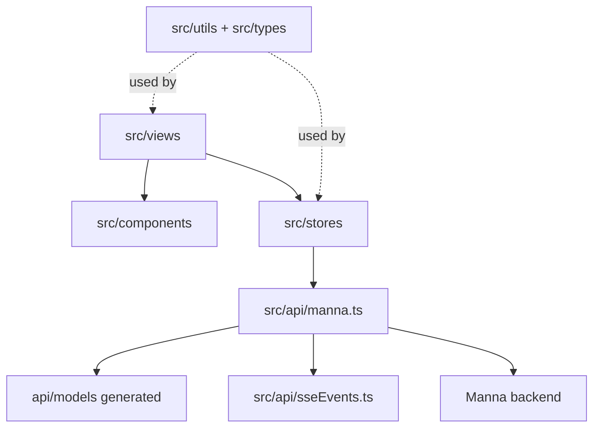

# Structure + change map

Use this file to quickly locate where a change belongs.

## Directory map

```text
.
├─ .ai/              AI-oriented docs and conventions
├─ .dev/             Bruno / Insomnia / Mockoon collections
├─ api/              OpenAPI-generated client/models (do not edit manually)
├─ cypress/          Cypress support and fixtures
├─ src/
│  ├─ api/           `manna.ts` (HTTP) + `sseEvents.ts` (SSE unions)
│  ├─ components/
│  │  ├─ layout/     App shell components (sidebar/header)
│  │  └─ shared/     Reusable components (markdown, graph canvas, etc.)
│  ├─ layouts/       Page-level shells (`AppLayout.vue`)
│  ├─ litegraph/     Graph runtime setup + custom nodes
│  ├─ locales/       i18n JSON dictionaries
│  ├─ router/        Route definitions (lazy-loaded views)
│  ├─ stores/        One Pinia store per file
│  ├─ types/         Shared TS types + barrel (`types/index.ts` only)
│  ├─ utils/         i18n/bootstrap/helpers
│  ├─ views/         Route-level pages
│  ├─ config.ts      `getMannaBaseUrl()` + runtime config helpers
│  └─ main.ts        App bootstrap
├─ tests/
│  ├─ unit/          Vitest unit tests
│  └─ e2e/           Cypress E2E specs
├─ openapi.yaml      Copied from `Guebbit/manna` (API source of truth)
├─ vite.config.ts    Vite config + aliases (`@`, `@types`, `@api`)
└─ package.json      Scripts/dependencies
```

## Layered architecture



## Common change patterns

| Goal                          | Primary files                                                                                     |
| ----------------------------- | ------------------------------------------------------------------------------------------------- |
| Add API endpoint              | `openapi.yaml` (backend), run `npm run genapi`, update `src/api/manna.ts` ([API guide](./API.md)) |
| Add SSE event type            | `src/api/sseEvents.ts` ([API guide](./API.md))                                                    |
| Add store                     | `src/stores/<name>.ts` ([Style rules](./STYLE.md))                                                |
| Add view/route                | `src/views/<Name>View.vue` + `src/router/index.ts` ([Style rules](./STYLE.md))                    |
| Add reusable component        | `src/components/shared/<Name>.vue` ([Style rules](./STYLE.md))                                    |
| Change backend URL behavior   | `src/config.ts` + `.env` + docs ([ENV guide](./ENV.md))                                           |
| Change request/response shape | Update backend OpenAPI, regenerate `api/` (`npm run genapi`) ([API guide](./API.md))              |
| Add/adjust dependencies       | `package.json` + this map + [tools inventory](./TOOLS.md)                                         |
| Add/adjust tests              | `tests/unit` / `tests/e2e` + [testing guide](./TESTING.md)                                        |

## Test layout

- **Unit:** `tests/unit/**/*.spec.ts` — Vitest, no real backend.
- **E2E:** `tests/e2e/**/*.spec.ts` — Cypress, requires running frontend + backend.
- **Run all local checks:** `npm run complete:check`.
