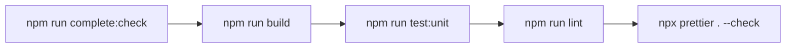

# Testing guide

Use this page for test layout, commands, and expected workflow.

## Official references

- Vitest: https://vitest.dev/guide/
- Cypress: https://docs.cypress.io/
- Vue Test Utils: https://test-utils.vuejs.org/
- jsdom: https://github.com/jsdom/jsdom

## Test layers

| Layer | Path                      | Tooling          | Purpose                                   |
| ----- | ------------------------- | ---------------- | ----------------------------------------- |
| Unit  | `tests/unit/**/*.spec.ts` | Vitest (+ jsdom) | Fast, isolated logic/store utility checks |
| E2E   | `tests/e2e/**/*.spec.ts`  | Cypress          | Full app flows in browser context         |

## Naming and placement

- Keep unit tests under `tests/unit`.
- Keep end-to-end tests under `tests/e2e`.
- Use `*.spec.ts` naming consistently.

## Commands

| Command                    | What it runs                         | Notes                                       |
| -------------------------- | ------------------------------------ | ------------------------------------------- |
| `npm run test:unit`        | Full unit suite                      | Default fast test pass                      |
| `npm run test:unit:target` | One target unit spec                 | Replace default spec in script as needed    |
| `npm run test:e2e`         | Cypress E2E against preview server   | Needs backend and Cypress runtime available |
| `npm run test:e2e:target`  | One target E2E spec                  | Replace spec path in script                 |
| `npm run test`             | Unit + E2E                           | Full test sweep                             |
| `npm run complete:check`   | Build + unit + lint + prettier check | Standard pre-PR check                       |

## Test pipeline

## Mocking notes

- `axios-mock-adapter` is installed and available for API-style test mocking.
- Current unit tests mainly stub/store dependencies using Vitest utilities.
- Prefer deterministic mocks/stubs over live network calls.

## Practical workflow

1. Run `npm run test:unit` during development.
2. Run `npm run complete:check` before finalizing.
3. Run `npm run test:e2e` when UI flow behavior changes.
