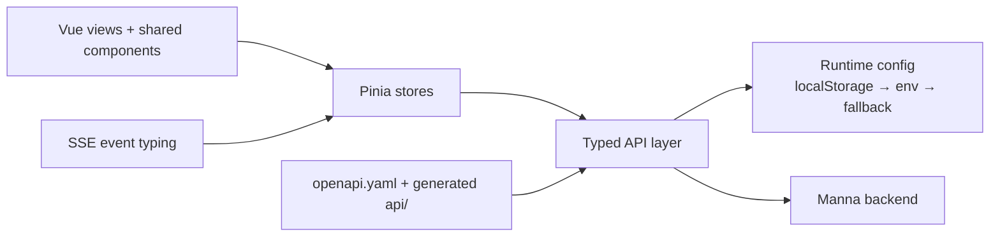

# Manna Frontend

Vue 3 frontend for using Manna features from the browser.

> [!IMPORTANT]
> This README and the files in [`docs/`](./docs/index.md) are the **human-facing documentation**.
> The files in [`.ai/`](./.ai/README.md) are **agent-facing instructions for AI coding tools** during agentic programming sessions. They are useful for automation, but they are **not** the primary contributor docs for humans.

## Jump in fast

- [Quick start](#quick-start)
- [What the app includes](#what-the-app-includes)
- [Architecture at a glance](#architecture-at-a-glance)
- [Documentation map](#documentation-map)
- [Developer workflow](#developer-workflow)

## Quick start

### Requirements

- Node.js 22+
- npm
- A running [`Guebbit/manna`](https://github.com/Guebbit/manna) backend (default: `http://localhost:3001`)

### Local setup

```bash
npm ci
cp .env-example .env
npm run dev
```

Open `http://localhost:8080`.

## What the app includes

| Area             | Route       | What it does                                        |
| ---------------- | ----------- | --------------------------------------------------- |
| Dashboard        | `/`         | Health checks, model overview, quick navigation     |
| Chat             | `/chat`     | Conversations and message history                   |
| Agent Task       | `/agent`    | Single-agent task execution                         |
| Code Tools       | `/code`     | Autocomplete, linting, and page review              |
| Upload & Analyze | `/upload`   | Image classify, speech-to-text, PDF text extraction |
| Graph Builder    | `/graph`    | Visual LiteGraph pipelines executed through Manna   |
| Swarm            | `/swarm`    | Multi-agent task decomposition                      |
| Workflow         | `/workflow` | Sequential multi-step pipelines                     |
| System Info      | `/system`   | Modes, models, health, backend help                 |
| Settings         | `/settings` | Backend URL and default runtime preferences         |

For the route-by-route breakdown, see [`docs/features.md`](./docs/features.md).

## Architecture at a glance



### Backend URL resolution

The frontend resolves the backend base URL in this order:

1. `localStorage` key `manna-base-url`
2. `VITE_MANNA_URL`
3. `http://localhost:3001`

## Documentation map

Start here if you want the polished version instead of scanning source files:

- [`docs/index.md`](./docs/index.md) — overview, reading order, and repo mental model
- [`docs/architecture.md`](./docs/architecture.md) — app layers, data flow, streaming, graph builder, i18n
- [`docs/features.md`](./docs/features.md) — every page, route, and the backend concepts behind it
- [`docs/tooling.md`](./docs/tooling.md) — frameworks, libraries, checks, generators, and official docs links

## Developer workflow

### Most useful scripts

- `npm run dev`
- `npm run build`
- `npm run test:unit`
- `npm run lint`
- `npm run lint:openapi`
- `npm run complete:check`
- `npm run genapi`

### Recommended validation

```bash
npm run complete:check
```

That runs:

- build
- unit tests
- eslint
- prettier check

## API contract sync

`openapi.yaml` in this repo is copied from [`Guebbit/manna`](https://github.com/Guebbit/manna) and treated as the source of truth.

After syncing `openapi.yaml`, regenerate the client:

```bash
npm run genapi
```

Do not edit files in `api/` manually.

## API runtime rule

- All non-streaming HTTP calls must use generated axios clients from `src/utils/api.ts`.
- SSE streaming endpoints (`/run/stream`, `/run/swarm/stream`, `/workflow/stream`) use `src/utils/sse.ts`.
- Do not add new fetch-based API wrappers for non-SSE endpoints.
