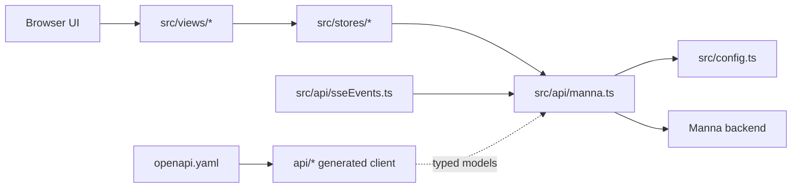
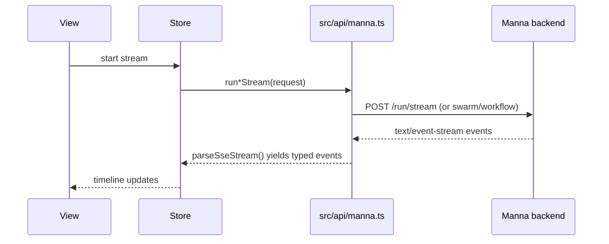
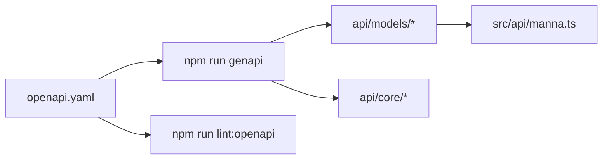

# Manna Frontend

Vue + TypeScript frontend for using Manna features from the browser.

## TL;DR

- **Install:** `npm ci`
- **Run:** `npm run dev` → open `http://localhost:8080`
- **Backend URL precedence:** `localStorage(manna-base-url)` → `VITE_MANNA_URL` → `http://localhost:3001`
- **Main checks:** `npm run complete:check`
- **API contract flow:** update `openapi.yaml` → `npm run genapi` (never edit `api/` manually)

## Table of contents

- [🚀 Setup](#-setup)
- [📦 Tech stack (with official docs)](#-tech-stack-with-official-docs)
- [🧱 Architecture](#-architecture)
- [✨ Features](#-features)
- [🗂️ Project layout](#️-project-layout)
- [🛠 Scripts](#-scripts)
- [🧪 Testing quickstart](#-testing-quickstart)
- [🔌 API contract sync](#-api-contract-sync)
- [🧰 API mocking / local dev tools](#-api-mocking--local-dev-tools)
- [📚 Further reading](#-further-reading)

## 🚀 Setup

### Requirements

- **Node.js** `22+` (project target)
- **npm**
- A running [`Guebbit/manna`](https://github.com/Guebbit/manna) backend (default: `http://localhost:3001`)

### Start locally

```bash
npm ci
cp .env-example .env
npm run dev
```

Open `http://localhost:8080`.

### Backend URL resolution

1. `localStorage` key `manna-base-url` (set in **Settings** page)
2. `VITE_MANNA_URL` (build-time env var)
3. Fallback: `http://localhost:3001`

See also: [.ai/ENV.md](./.ai/ENV.md).

## 📦 Tech stack (with official docs)

| Tool                       | What for                             | Official docs                                             | Where used in repo                                  |
| -------------------------- | ------------------------------------ | --------------------------------------------------------- | --------------------------------------------------- |
| Vue 3                      | UI framework                         | https://vuejs.org/                                        | `src/`                                              |
| TypeScript                 | Static typing                        | https://www.typescriptlang.org/docs/                      | `src/`, `tests/`                                    |
| Vite                       | Build/dev server                     | https://vite.dev/guide/                                   | `vite.config.ts`                                    |
| Vuetify                    | UI components                        | https://vuetifyjs.com/en/introduction/why-vuetify/        | `src/main.ts`, views/components                     |
| Pinia                      | State management                     | https://pinia.vuejs.org/                                  | `src/stores/`                                       |
| Vue Router                 | Routing                              | https://router.vuejs.org/                                 | `src/router/index.ts`                               |
| vue-i18n                   | Localization                         | https://vue-i18n.intlify.dev/                             | `src/utils/i18n.ts`, `src/locales/`                 |
| litegraph.js               | Visual graph editor                  | https://github.com/jagenjo/litegraph.js                   | `src/litegraph/`, `GraphBuilderView.vue`            |
| Marked                     | Markdown parser                      | https://marked.js.org/                                    | `src/components/shared/MarkdownRenderer.vue`        |
| marked-highlight           | Marked highlighting bridge           | https://github.com/markedjs/marked-highlight              | `src/components/shared/MarkdownRenderer.vue`        |
| highlight.js               | Code highlighting                    | https://highlightjs.org/                                  | `src/components/shared/MarkdownRenderer.vue`        |
| axios                      | Generated API client transport       | https://axios-http.com/                                   | `api/` generated client config                      |
| @guebbit/vue-toolkit       | Shared toolkit utilities/composables | https://www.npmjs.com/package/@guebbit/vue-toolkit        | `src/stores/*`                                      |
| openapi-typescript-codegen | API client generation                | https://github.com/ferdikoomen/openapi-typescript-codegen | `npm run genapi`                                    |
| Spectral                   | OpenAPI linting                      | https://meta.stoplight.io/docs/spectral                   | `npm run lint:openapi`                              |
| ESLint                     | Linting                              | https://eslint.org/docs/latest/                           | `eslint.config.ts`                                  |
| Prettier                   | Formatting                           | https://prettier.io/docs/en/                              | `.prettierrc`                                       |
| Vitest                     | Unit testing                         | https://vitest.dev/guide/                                 | `tests/unit/`, `vitest.config.ts`                   |
| Cypress                    | E2E testing                          | https://docs.cypress.io/                                  | `tests/e2e/`, `cypress.config.ts`                   |
| Zod                        | Schema validation toolkit            | https://zod.dev/                                          | `package.json` (currently not imported in app code) |
| openapi-zod-client         | Optional OpenAPI→Zod generation      | https://github.com/astahmer/openapi-zod-client            | `package.json` (currently not imported in app code) |

## 🧱 Architecture



### Streaming flow (Agent / Swarm / Workflow)



### OpenAPI sync flow



## ✨ Features

- **Dashboard** → [`src/views/DashboardView.vue`](./src/views/DashboardView.vue), [`src/stores/system.ts`](./src/stores/system.ts)
- **Chat** → [`src/views/ChatView.vue`](./src/views/ChatView.vue), [`src/stores/chat.ts`](./src/stores/chat.ts)
- **Agent Task** (`/run`, `/run/stream`) → [`src/views/AgentView.vue`](./src/views/AgentView.vue), [`src/stores/agent.ts`](./src/stores/agent.ts)
- **Swarm** (`/run/swarm`, `/run/swarm/stream`) → [`src/views/SwarmView.vue`](./src/views/SwarmView.vue), [`src/stores/swarm.ts`](./src/stores/swarm.ts)
- **Workflow** (`/workflow`, `/workflow/stream`) → [`src/views/WorkflowView.vue`](./src/views/WorkflowView.vue), [`src/stores/workflow.ts`](./src/stores/workflow.ts)
- **Code Tools** (autocomplete/lint/review) → [`src/views/CodeToolsView.vue`](./src/views/CodeToolsView.vue), [`src/stores/ide.ts`](./src/stores/ide.ts)
- **Upload & Analyze** (image classify, speech-to-text, PDF extract) → [`src/views/UploadAnalyzeView.vue`](./src/views/UploadAnalyzeView.vue), [`src/stores/upload.ts`](./src/stores/upload.ts)
- **Graph Builder** (LiteGraph) → [`src/views/GraphBuilderView.vue`](./src/views/GraphBuilderView.vue), [`src/stores/graph.ts`](./src/stores/graph.ts)
- **System Info** → [`src/views/SystemInfoView.vue`](./src/views/SystemInfoView.vue), [`src/stores/system.ts`](./src/stores/system.ts)
- **Settings** (backend URL + defaults) → [`src/views/SettingsView.vue`](./src/views/SettingsView.vue)
- **Notifications** (user-facing API/state errors) → [`src/stores/notification.ts`](./src/stores/notification.ts)

## 🗂️ Project layout

```text
src/
├─ api/          API wrappers + SSE types
├─ components/   Reusable UI blocks
├─ layouts/      App shell
├─ locales/      i18n messages
├─ litegraph/    Graph editor setup + custom nodes
├─ router/       Route definitions
├─ stores/       Pinia stores
├─ types/        Shared TS types
├─ utils/        Utility modules (incl. i18n bootstrap)
└─ views/        Route-level pages
```

For the full map and change patterns, see [.ai/STRUCTURE.md](./.ai/STRUCTURE.md).

## 🛠 Scripts

| Script                   | Purpose                                    | When to use                               |
| ------------------------ | ------------------------------------------ | ----------------------------------------- |
| `npm run dev`            | Local development server on `:8080`        | Daily feature development                 |
| `npm run build`          | Type-check + production build              | Validate release readiness                |
| `npm run test:unit`      | Run Vitest unit tests                      | Fast feedback during development          |
| `npm run test:e2e`       | Run Cypress E2E suite                      | End-to-end validation                     |
| `npm run lint`           | Run ESLint                                 | Catch static code issues                  |
| `npm run lint:openapi`   | Lint `openapi.yaml` via Spectral           | API contract quality checks               |
| `npm run prettier:fix`   | Auto-format files                          | Before committing docs/code style updates |
| `npm run genapi`         | Regenerate `api/` from OpenAPI             | After backend contract updates            |
| `npm run complete:check` | Build + unit tests + lint + prettier check | Final local pre-PR check                  |

## 🧪 Testing quickstart

- **Unit tests:** `tests/unit/**/*.spec.ts` (Vitest)
- **E2E tests:** `tests/e2e/**/*.spec.ts` + `cypress/`
- **Targeted unit run:** `npm run test:unit:target`
- **Targeted E2E run:** `npm run test:e2e:target`

More details: [.ai/TESTING.md](./.ai/TESTING.md).

## 🔌 API contract sync

`openapi.yaml` in this repo is copied from `Guebbit/manna` and treated as source of truth.

After syncing `openapi.yaml`, regenerate client files:

```bash
npm run genapi
```

Do not edit files in `api/` manually.

More details: [.ai/API.md](./.ai/API.md).

## 🧰 API mocking / local dev tools

The `.dev/` directory contains request collections for local API exploration:

- [Bruno](https://www.usebruno.com/docs/get-started/overview): `.dev/Ecommerce Demo API - Bruno.yml`
- [Insomnia](https://docs.insomnia.rest/): `.dev/Ecommerce Demo API - Insomnia.json`
- [Mockoon](https://mockoon.com/docs/latest/): `.dev/Ecommerce Demo API - Mockoon.json`

## 📚 Further reading

- [.ai/README.md](./.ai/README.md) — AI-oriented project index and invariants
- [.ai/STRUCTURE.md](./.ai/STRUCTURE.md) — directory map + common change patterns
- [.ai/API.md](./.ai/API.md) — API layer boundaries, SSE contracts, error model
- [.ai/STYLE.md](./.ai/STYLE.md) — naming, JSDoc, formatting, error-handling rules
- [.ai/ENV.md](./.ai/ENV.md) — runtime env and backend URL resolution
- [.ai/TOOLS.md](./.ai/TOOLS.md) — categorized tool inventory + links
- [.ai/TESTING.md](./.ai/TESTING.md) — testing strategy and command reference
