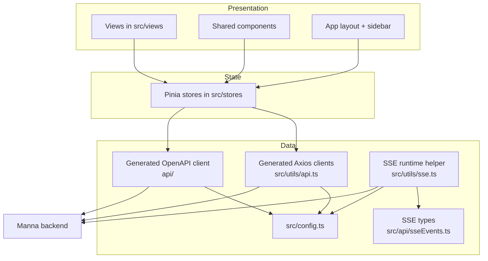
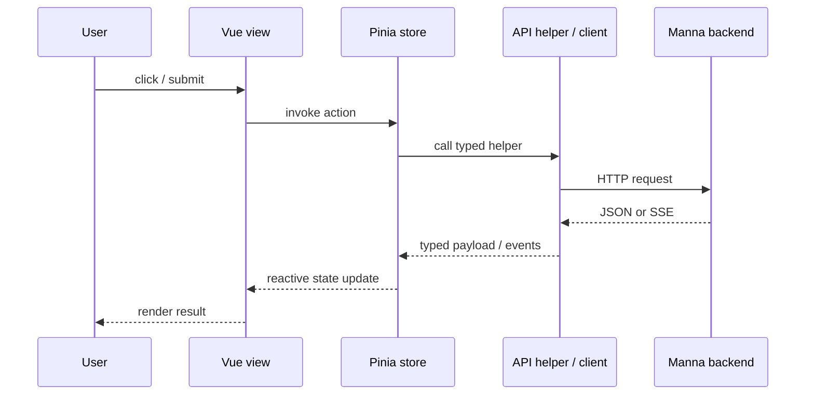
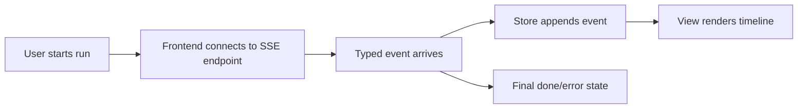

# Architecture

This page explains the main ideas behind the frontend without making you reverse-engineer the source tree.

## TL;DR

- **Vue 3** renders the UI
- **Pinia** stores coordinate state and async actions
- **Vue Router** maps features to routes
- **Vuetify** provides the UI shell and components
- **`src/utils/api.ts`** is the canonical generated axios API surface
- **`api/`** contains generated types and clients from `openapi.yaml`
- **`src/api/sseEvents.ts`** models streaming events that OpenAPI cannot generate for us
- **`src/utils/sse.ts`** handles SSE streaming requests
- **`src/config.ts`** resolves the backend URL from settings, env, or fallback

Related reading:

- [Features](./features.md)
- [Tooling](./tooling.md)

## Layered view

## Request flow

## Main architectural ideas

### 1. Views stay presentation-focused

The pages in `src/views/` are route-level screens such as Chat, Agent, Workflow, and Graph Builder.

Their job is mostly to:

- collect user input
- render state
- call store actions
- display live stream timelines and results

### 2. Stores own app state and async orchestration

The files in `src/stores/` are the operational center of the app.

Examples:

- `agent.ts` manages normal and streaming task execution
- `workflow.ts` manages sequential workflow runs
- `system.ts` manages health, modes, models, and backend help
- `graph.ts` serializes and executes LiteGraph graphs

### 3. API types are generated, but not everything can be generated

The repo uses `openapi.yaml` as the backend contract source of truth, then generates `api/`.

That gives the project:

- shared request/response types
- generated API classes
- a stable contract to sync with the backend

But streaming event payloads are not fully representable in the generated client, so the frontend keeps those definitions in [`src/api/sseEvents.ts`](../src/api/sseEvents.ts).

### 4. Runtime backend selection is user-configurable

The frontend can target different backend instances without rebuilding the app every time.

Priority order:

1. `localStorage["manna-base-url"]`
2. `VITE_MANNA_URL`
3. `http://localhost:3001`

That logic lives in [`src/config.ts`](../src/config.ts).

### 5. Runtime HTTP is generated-client-first

- `api/` is generated from OpenAPI and should not be edited manually
- `src/utils/api.ts` is the only allowed non-streaming HTTP integration surface
- `src/utils/sse.ts` is the only allowed custom fetch surface, scoped to SSE streaming endpoints

## Streaming model

Agent and Workflow all support live streaming via Server-Sent Events.

Why this matters:

- the UI can show progress instead of waiting for one final blob
- the event timeline becomes debuggable
- `hard_stop` and other backend control events can be surfaced explicitly

## Graph Builder theory

The Graph Builder is the most unusual part of the repo.

- It uses [`litegraph.js`](https://github.com/jagenjo/litegraph.js) for a node-based UI
- Nodes are registered in `src/litegraph/nodes/`
- The live graph is serialized through the Pinia graph store
- The serialized graph is currently sent to Manna as part of a natural-language task

So the Graph Builder is currently:

1. a **visual authoring tool** in the frontend
2. a **serialization layer** for graph JSON
3. a **bridge** to the normal `/run` backend path

## Localization model

The app uses `vue-i18n` with dynamic locale loading from `src/locales/*.json`.

That means:

- locale files stay out of the main bundle until needed
- supported locales are inferred from the filesystem unless env vars override them
- switching locale updates the document language attribute

## File/folder landmarks

| Location | Why it matters |
| --- | --- |
| `src/views/` | Route-level pages |
| `src/stores/` | State + async orchestration |
| `src/utils/api.ts` | Generated client wiring used by stores |
| `src/api/sseEvents.ts` | Streaming event shapes |
| `src/utils/sse.ts` | SSE request + stream parsing helper |
| `src/utils/api.ts` | Generated client wiring |
| `src/litegraph/` | Graph Builder node system |
| `api/` | Generated OpenAPI output |
| `openapi.yaml` | Contract source of truth |

## Need more detail?

- For user-facing pages: [Features](./features.md)
- For library and tooling explanations: [Tooling](./tooling.md)
