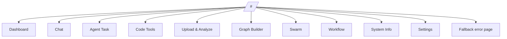
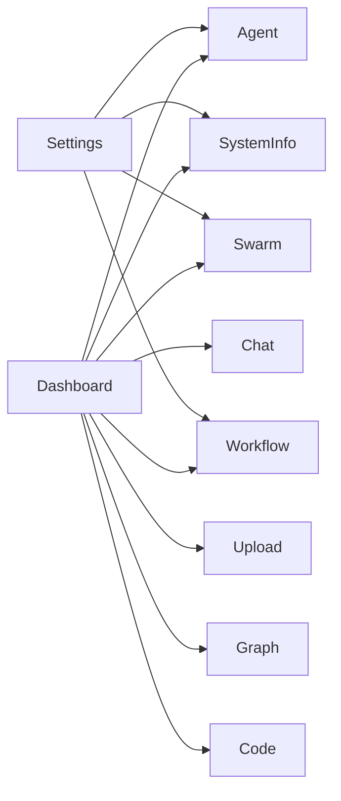

# Features and routes

This page maps the app surface area to the real routes, stores, and backend ideas used in the codebase.

## Route map

## Page-by-page guide

| Feature | Route | Main store(s) | Backend/API concept | Notes |
| --- | --- | --- | --- | --- |
| Dashboard | `/` | `system` | Health and model overview | Also acts as a launch pad into the rest of the app |
| Chat | `/chat`, `/chat/conversations/:id` | `chat` | Conversations and messages | Includes list + detail style navigation |
| Agent Task | `/agent` | `agent` | `/run` and `/run/stream` | Supports final-result and live-stream modes |
| Code Tools | `/code` | `ide` | autocomplete, lint-conventions, page-review | Focused on developer assistance endpoints |
| Upload & Analyze | `/upload` | `upload` | multipart upload endpoints | Image classify, speech-to-text, PDF reading |
| Graph Builder | `/graph` | `graph` | LiteGraph + `/run` bridge | Serializes a visual graph into an executable task |
| Swarm | `/swarm` | `swarm` | `/run/swarm` and `/run/swarm/stream` | Multi-agent task decomposition |
| Workflow | `/workflow` | `workflow` | `/workflow` and `/workflow/stream` | Sequential step execution |
| System Info | `/system` | `system` | `/health`, `/info/*`, `/help` | Backend visibility and discoverability |
| Settings | `/settings` | config helpers + system APIs | runtime backend base URL | Stores base URL in `localStorage` |
| Error page | catch-all | route state | fallback rendering | Handles unknown routes |

## Feature concepts worth knowing

### Chat

- persistent conversation history
- route-aware conversation selection
- typed message and conversation models from generated API types

### Agent Task

- single-agent execution
- optional streaming timeline
- explicit handling for `done`, `error`, and `hard_stop` events

### Swarm

- one task becomes multiple subtasks
- the UI surfaces decomposition and subtask progress
- still reuses some event ideas from the normal agent flow

### Workflow

- sequential tasks instead of independent subtasks
- step-oriented event stream
- duration/progress data is especially important here

### Code Tools

- autocomplete
- convention-aware lint review
- AI-assisted page review

### Upload & Analyze

- file-drop style interaction
- multipart uploads
- different response payloads depending on the selected operation

### Graph Builder

The graph feature is backed by custom LiteGraph nodes:

- text input
- text output
- LLM generate
- shell
- browser fetch
- read file
- write file
- semantic search

This is the feature that most strongly mixes UI interaction, serialization, and backend execution.

### System Info

This area documents the backend from inside the app itself:

- health status
- modes / routing profiles
- models
- backend help reference

## How the features connect

## Where to read next

- Want the internals behind these pages? Read [Architecture](./architecture.md)
- Want official docs for the frameworks and libraries involved? Read [Tooling](./tooling.md)
