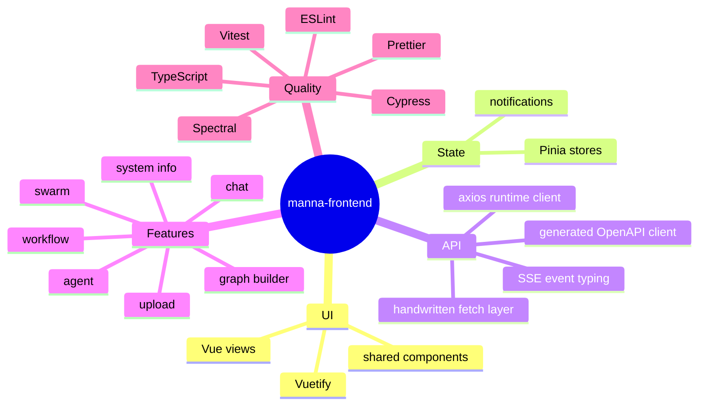

# Documentation index

This section is the **human-readable documentation hub** for `manna-frontend`.

> [!IMPORTANT]
> The [`.ai/`](../.ai/README.md) folder is for AI agents and automation workflows.
> Humans should start here instead.

## Start here

- If you are new to the repo: go back to the [root README](../README.md)
- If you want the big picture: read [Architecture](./architecture.md)
- If you want the app surface area: read [Features](./features.md)
- If you want the stack and official docs: read [Tooling](./tooling.md)

## Fast mental model

## Reading order

1. [README](../README.md) for setup and high-level orientation
2. [Architecture](./architecture.md) for how the app is put together
3. [Features](./features.md) for what users can do in the app
4. [Tooling](./tooling.md) for the libraries, generators, and checks used here

## What these docs try to answer

- What is this frontend responsible for?
- Which route maps to which feature?
- Which libraries are actually part of the app?
- How do OpenAPI generation and SSE fit together?
- What should a contributor run before opening a PR?

## What is intentionally separate

- [`.ai/README.md`](../.ai/README.md) and the other `.ai/*` files: machine-facing guidance for coding agents
- Source-level JSDoc: implementation detail
- The backend API specification: [`openapi.yaml`](../openapi.yaml)
